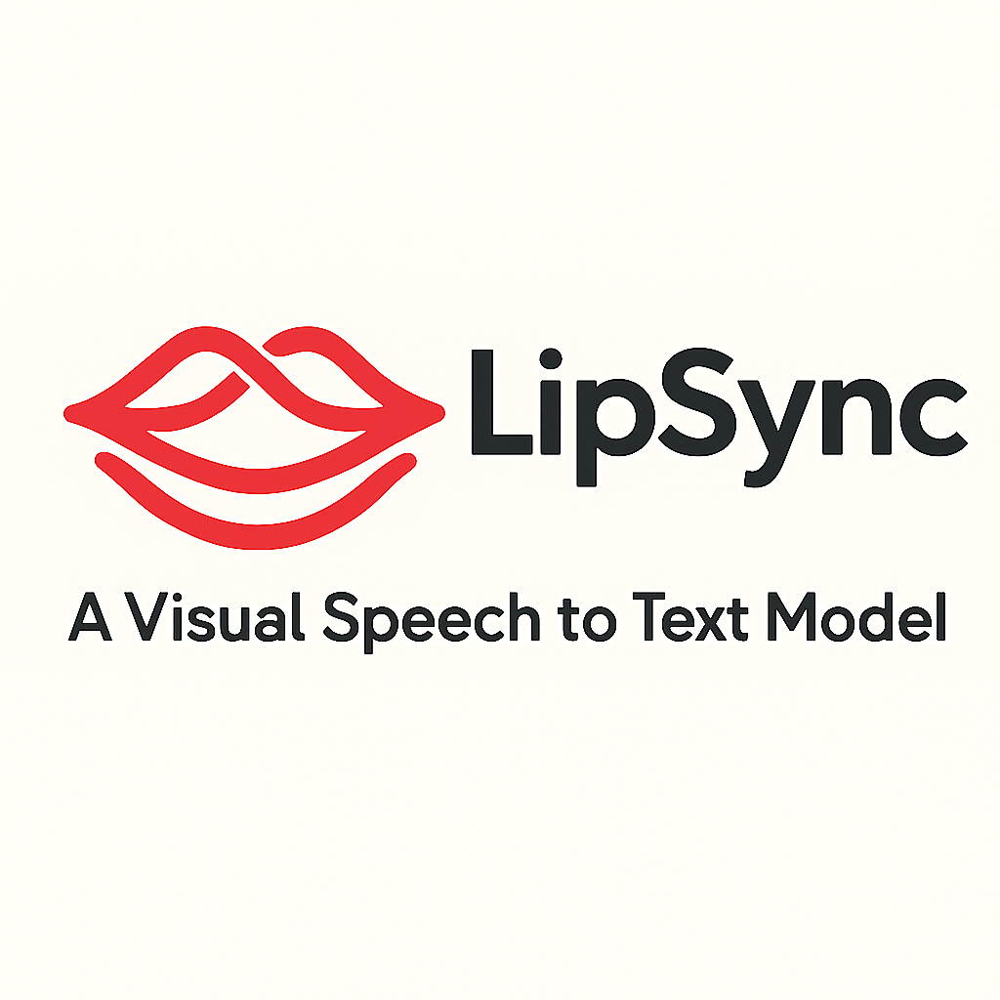
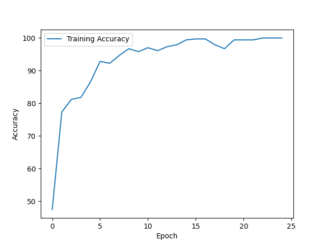
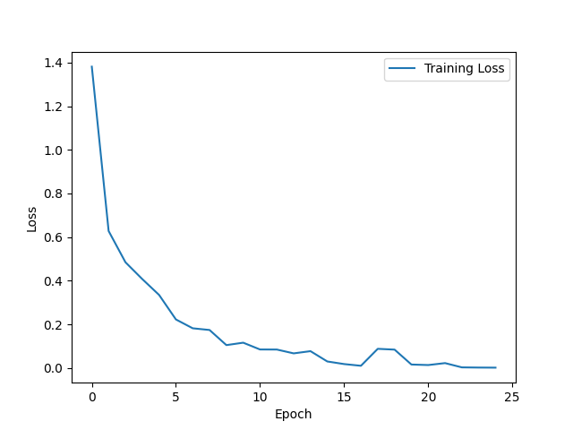
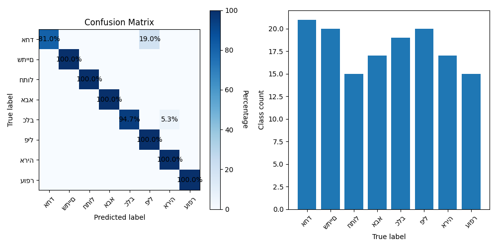
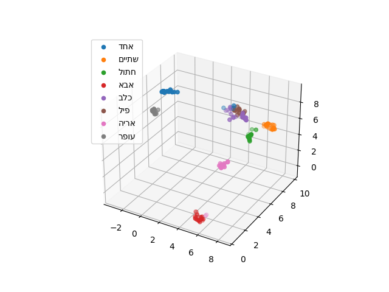
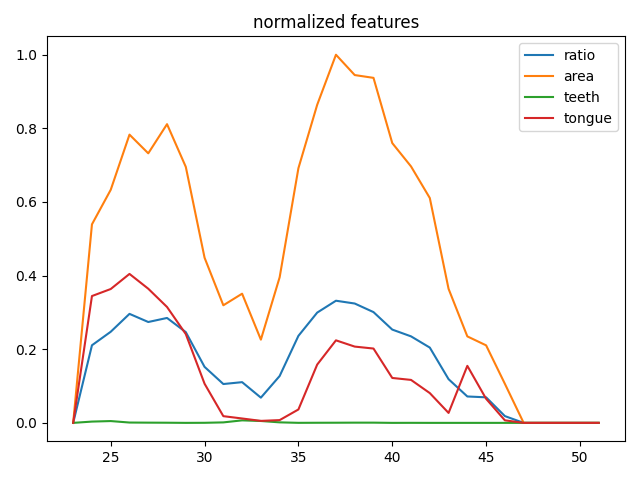

# Lip Sync Core - A Visual Speech-to-Text Model

<p>
  
</p>

**Multi-stage pipeline for creating, training, and evaluating a lip-reading model from video data.**  
This project extracts detailed facial features from video clips and transforms them into normalized, 
labeled datasets suitable for training a deep learning-based lip-reading classifier.

---

## Overview

This repository includes:
- Data labeling from video using MediaPipe FaceMesh
- Dataset construction from labeled sequences
- CNN model training with PyTorch
- Real-time word prediction and evaluation
- Rich visualizations (loss curves, UMAP, confusion matrix, etc.)

---

## Repository Structure

```
.
├── constants/                # Shared constants (e.g., paths, class names)
├── data_samples/            # Raw feature extraction and labeling tools
├── datasets/                # Dataset generation and splitting
├── evaluate_model.py        # Model evaluation and metrics
├── model/                   # CNN model architecture
├── run_full_cycle.py        # Orchestrates training + evaluation
├── stats/                   # Output statistics and plots
├── test_real_time.py        # Live prediction on new video samples
├── train.py                 # Model training loop
├── utils/                   # Feature extraction, normalization, plotting
├── videos/                  # Input video directory (by class)
└── README.md
```

---

## Setup

### Requirements

Install the required packages with:

```bash
pip install -r requirements.txt
```

Requirements include:
- Python 3.7+
- OpenCV
- MediaPipe
- NumPy, Pandas, Matplotlib, scikit-learn
- UMAP-learn
- PyTorch

---

## Usage

### 1. Create Labeled Data from Videos

Organize your `.mp4` videos by class inside the `videos/` folder:
```
videos/
├── אבא/
│   └── video1.mp4
├── חתול/
│   └── video2.mp4
...
```

Then run:

```bash
python data_samples/create_labeled_samples.py
```

This will:
- Extract lip features using MediaPipe
- Normalize and store labeled sequences
- Output visualizations and CSVs to `Data/<class>/`

### 2. Generate a Train/Test Dataset

```bash
python datasets/create_dataset.py
```

This generates PyTorch datasets from your labeled data.

### 3. Train the CNN Model

```bash
python train.py
```

This saves:
- Trained model weights to `MODEL_PATH`
- Loss/accuracy plots to the `stats/` directory

### 4. Evaluate the Model

```bash
python evaluate_model.py
```

This produces:
- Confusion matrix
- Per-class accuracy
- UMAP plot of embedded features

### 5. Live Test a Word on a Video File

```bash
python test_real_time.py
```

This allows you to test model performance on new samples interactively.

### 6. Run the Full Cycle

```bash
python run_full_cycle.py
```

This executes training and evaluation in one step.

---

## Feature Summary

### Feature Extraction (`extract_features.py`)
- Ratio: vertical/horizontal lip dimensions
- Area: bounding box pixel count
- Teeth: white pixel ratio
- Tongue: tongue-color pixel ratio

### Plotting Tools (`utils/plots.py`)
- Loss & accuracy curves
- UMAP embedding in 3D
- Confusion matrix

---

## Key Modules and Functions

| Module                     | Purpose                                      |
|----------------------------|----------------------------------------------|
| `data_samples/create_labeled_samples.py` | Extract features and label sequences    |
| `datasets/create_dataset.py`            | Convert labeled data into train/test    |
| `model/cnn.py`                          | Defines the CNN architecture            |
| `train.py`                              | Trains the model                        |
| `evaluate_model.py`                     | Evaluates trained model with metrics    |
| `test_real_time.py`                     | Performs inference on test videos       |

---

## Contributing

To contribute, fork the repository and submit a pull request with:
- Clean, commented code
- Matching updates to `README.md` if applicable
- Tests or reproducible examples if adding new functionality

---

### Model Training Results 
#### Dataset
- 10 words
- 60 video samples per word
- train: 70%
- test: 30%

#### Accuracy Over Epochs


The training accuracy steadily improves, reaching near-perfect results. This indicates that the model learns well from the provided features.

---

#### Loss Over Epochs


Training loss decreases rapidly during the early epochs, confirming effective learning and convergence of the model.

---

#### Confusion Matrix and Class Distribution


- Left: Confusion matrix shows how often each word was correctly or incorrectly predicted.
- Right: Distribution of true labels across classes. Balanced class distribution is critical for model performance.

---

#### UMAP Visualization of Features


A 3D UMAP projection of the model’s internal representations. Clusters indicate that the model has learned to separate word classes based on visual features.

---

#### Feature representation
**Normalized Feature extracted Per word**

- **Ratio, Area, Teeth, Tongue** over time during speech.
- These curves help visualize the dynamic behavior of mouth shapes during word articulation.

Example:


---
## Author

**Ofer Zvi Simchovitch**  
Lip-reading research & software development  
Contact: [ofrsm10@gmail.com](mailto:ofrsm10@gmail.com)

---

## License

This project is released under the MIT License.

---